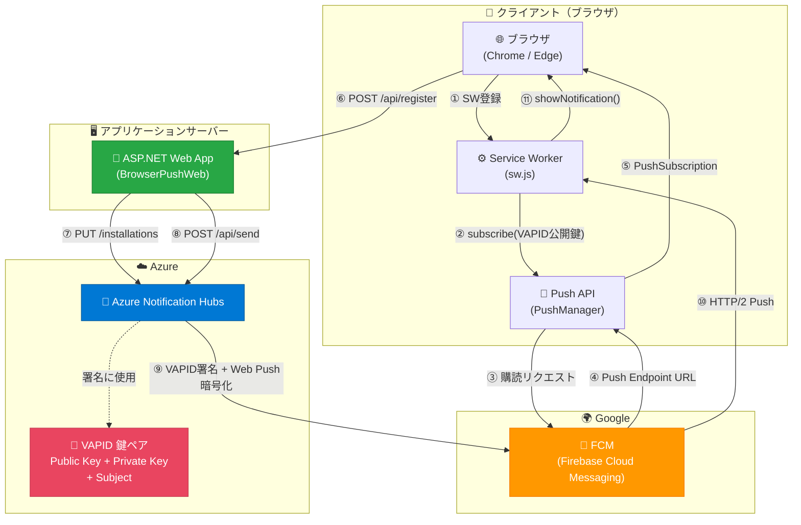

# Browser Push Notification Sample

Azure Notification Hubs を使ったブラウザプッシュ通知 (Web Push) の E2E サンプルです。

## アーキテクチャ



### 登録フェーズ（①〜⑦）

| # | 区間 | プロトコル | 内容 |
|---|------|-----------|------|
| ① | ブラウザ → Service Worker | ローカル | `navigator.serviceWorker.register('/sw.js')` |
| ② | SW → Push API | ローカル | `PushManager.subscribe({ applicationServerKey })` |
| ③ | ブラウザ → FCM | HTTPS | Google FCM に購読を登録 |
| ④ | FCM → ブラウザ | HTTPS | Push Endpoint URL を返却 (`https://fcm.googleapis.com/fcm/send/...`) |
| ⑤ | Push API → ブラウザ | ローカル | `PushSubscription { endpoint, keys: { p256dh, auth } }` |
| ⑥ | ブラウザ → WebApp | HTTP | PushSubscription をサーバーに POST |
| ⑦ | WebApp → Azure NH | HTTPS (SAS認証) | `BrowserInstallation` として登録 |

### 送信フェーズ（⑧〜⑪）

| # | 区間 | プロトコル | 内容 |
|---|------|-----------|------|
| ⑧ | WebApp → Azure NH | HTTPS (SAS認証) | `SendNotificationAsync()` でペイロード送信 |
| ⑨ | Azure NH → FCM | HTTPS | VAPID Private Key で JWT 署名 + RFC 8291 でペイロード暗号化 |
| ⑩ | FCM → Service Worker | HTTP/2 Push | FCM がブラウザへの常時接続経由で配信 |
| ⑪ | SW → ブラウザ | ローカル | `showNotification()` で通知表示 + `postMessage()` でページに通知 |

### 各コンポーネントの役割

| コンポーネント | 役割 |
|---------------|------|
| **Azure Notification Hubs** | VAPID 署名、Web Push 暗号化（RFC 8291）、デバイス管理、タグベースルーティング。アプリ側は FCM を意識しなくてよい |
| **FCM** | ブラウザとの持続接続を維持するプッシュリレー。Chromium 系ブラウザ (Chrome, Edge) は全て FCM を経由する |
| **Service Worker** | バックグラウンドで push イベントを受信し、通知を表示する |
| **VAPID** | Voluntary Application Server Identification。サーバーの身元を証明する鍵ペア。Subject は `mailto:` URL が必須 |

### ネットワーク要件

| 通信経路 | ポート | ホスト | 用途 |
|---------|--------|--------|------|
| WebApp → Azure NH | 443 | `*.servicebus.windows.net` | Installation 登録・通知送信 |
| Azure NH → FCM | 443 | `fcm.googleapis.com` | Web Push Protocol でプッシュ配信 |
| ブラウザ → FCM | 443 | `*.google.com`, `mtalk.google.com:5228` | 購読登録 + プッシュ受信の常時接続 |
| ブラウザ → WebApp | 5285 | `localhost` | API 通信（開発時） |

## プロジェクト構成

```
BrowserPushSample/
├── BrowserPushSample/          # コンソールアプリ（SDK 単体テスト用）
│   └── Program.cs              #   7ステップの登録→送信フロー
├── BrowserPushWeb/             # ASP.NET Web アプリ（E2E テスト用）
│   ├── Program.cs              #   API サーバー + SDK バグ回避ハンドラー
│   └── wwwroot/
│       ├── index.html          #   4ステップ UI (SW登録→購読→NH登録→送信)
│       └── sw.js               #   Service Worker (push受信→通知表示)
├── browser-push.spec.js        # Playwright E2E テスト（Azure NH 経由）
├── direct-push.spec.js         # Playwright 直接テスト（web-push ライブラリ経由）
└── playwright.config.js        # Playwright 設定
```

## セットアップ

### 前提条件

- .NET SDK 6.0 以上
- Node.js 18 以上
- Azure Notification Hub（Browser (Web Push) が有効化済み）
- VAPID 鍵ペアが Hub に設定済み

### 1. 設定

`BrowserPushWeb/appsettings.json` に接続文字列とハブ名を設定:

```json
{
  "NotificationHub": {
    "ConnectionString": "Endpoint=sb://YOUR-NS.servicebus.windows.net/;SharedAccessKeyName=DefaultFullSharedAccessSignature;SharedAccessKey=YOUR-KEY",
    "HubName": "your-hub-name"
  }
}
```

### 2. Web アプリの起動

```bash
cd BrowserPushWeb
dotnet run
```

ブラウザで `http://localhost:5285` を開き、ステップ 1〜4 を順に実行。

### 3. Playwright E2E テストの実行

```bash
npm install
npx playwright install chromium
npx playwright test browser-push.spec.js --headed
```

## 発見した SDK の既知の問題

このサンプルの開発中に発見した Azure Notification Hubs .NET SDK のバグ:

| # | 問題 | 影響 | 回避策 |
|---|------|------|--------|
| 1 | `BrowserInstallation` の `pushChannel` が JSON オブジェクトではなく JSON 文字列として直列化される | `PUT /installations` が 400 エラー | `BrowserPushChannelFixHandler` (DelegatingHandler) でリクエスト本文をインターセプトして修正 |
| 2 | `GetInstallationAsync()` で `pushChannel` の逆直列化に失敗する | Installation の取得不可 | 回避不可（使用しない） |
| 3 | `SendDirectNotificationAsync` + `EnableTestSend` でレスポンスの逆直列化エラー ("Root element is missing") | 直接送信の結果取得不可 | タグベース送信 (`SendNotificationAsync`) を使用 |

### VAPID Subject に関する注意

Azure Notification Hub の BrowserCredential に設定する **Subject** は、Web Push の仕様 (RFC 8292) に従い `mailto:` または `https://` で始まる URL でなければなりません。不正な値（例: `"test"`）を設定すると、FCM が JWT を拒否し、全ての通知配信が失敗します。

```
❌ Subject: "test"           → 全配信失敗 (unknown error)
✅ Subject: "mailto:you@example.com"  → 正常に配信
```
